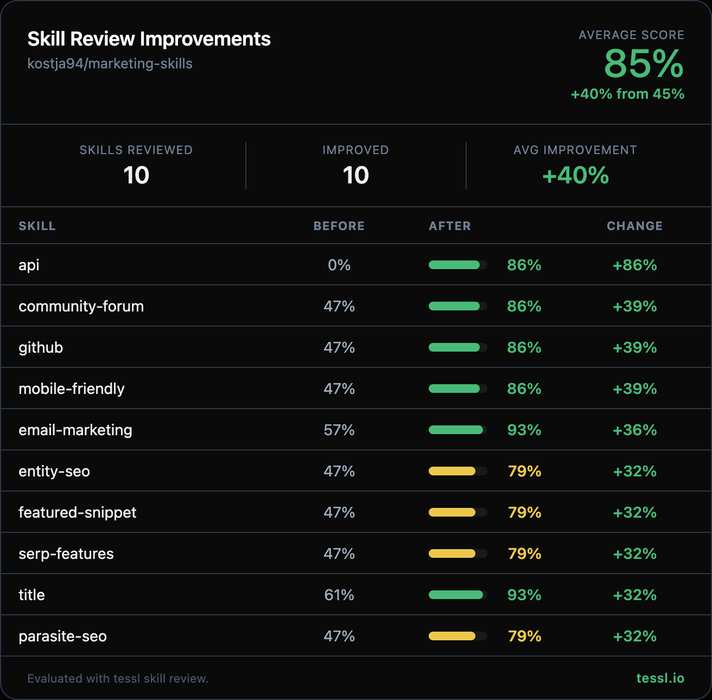

Hey 👋 @kostja94

I ran your skills through `tessl skill review` at work and found some targeted improvements. Here's the full before/after:

| Skill | Before | After | Change |
|-------|--------|-------|--------|
| api-page-generator | 0% | 86% | +86% |
| community-forum | 47% | 86% | +39% |
| github | 47% | 86% | +39% |
| mobile-friendly | 47% | 86% | +39% |
| email-marketing | 57% | 93% | +36% |
| entity-seo | 47% | 79% | +32% |
| featured-snippet | 47% | 79% | +32% |
| serp-features | 47% | 79% | +32% |
| title-tag | 61% | 93% | +32% |
| parasite-seo | 47% | 79% | +32% |
| **Average (170 skills)** | **75.6%** | **84.6%** | **+9.0%** |

94 of 170 skills improved. 11 skills that scored lower after changes were reverted to originals.

Changes made

All changes are description-only (frontmatter) — no content body was modified. The single consistent improvement across all 113 files:

- **Added concrete action verbs**: Descriptions now lead with what the skill *does* (e.g., "Audits and optimizes...", "Guides creation of...", "Creates, optimizes, and audits...") instead of only saying *when* to use it
- **Improved specificity**: Descriptions now name specific capabilities, outputs, and domain scope (e.g., "Knowledge Graph presence, schema markup, entity relationships" instead of just "entity SEO")
- **Quoted all descriptions**: Converted bare YAML strings to properly quoted format, fixing a YAML parse error on `api-page-generator` (0% → 86%)
- **Preserved all trigger terms**: Every original "Use when" keyword was kept — we only added specificity, never removed terms
- **Preserved all domain expertise**: No expert framing, specialized terminology, or content body was changed

Honest disclosure — I work at @tesslio where we build tooling around skills like these. Not a pitch - just saw room for improvement and wanted to contribute.

Want to self-improve your skills? Just point your agent (Claude Code, Codex, etc.) at [this Tessl guide](https://docs.tessl.io/evaluate/optimize-a-skill-using-best-practices) and ask it to optimize your skill. Ping me - [@rohan-tessl](https://github.com/rohan-tessl) - if you hit any snags.

Thanks in advance 🙏
